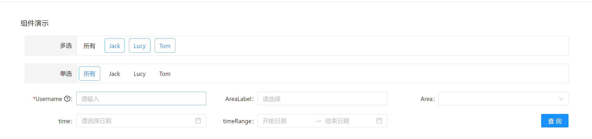

## antd components library
## 使用 React+typescript 的组件库

  

~~~javascript
npm install antdpackaging --save
~~~

### 使用
~~~javascript
// 加载样式
import 'antdpackaging/dist/index.css'
// 引入组件
import { FormComponent } from 'antdpackaging'
~~~

~~~bash
//git地址
https://github.com/xiaoxiaoyuanwang/antdpackaging.git
//启动本地环境
npm run stroybook

// build可发布静态文件
npm run build
~~~
