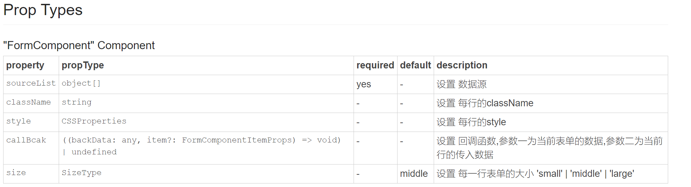
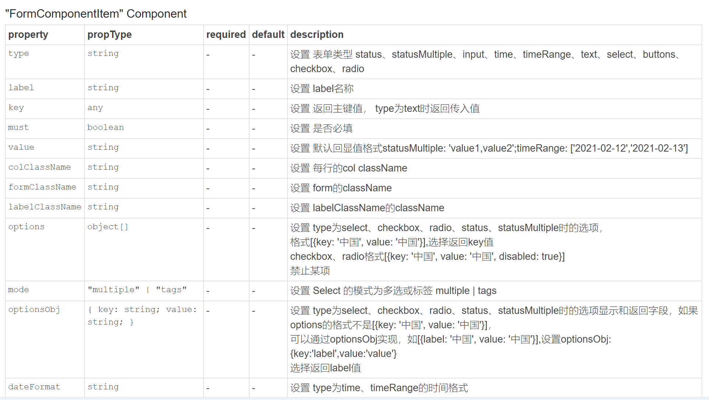
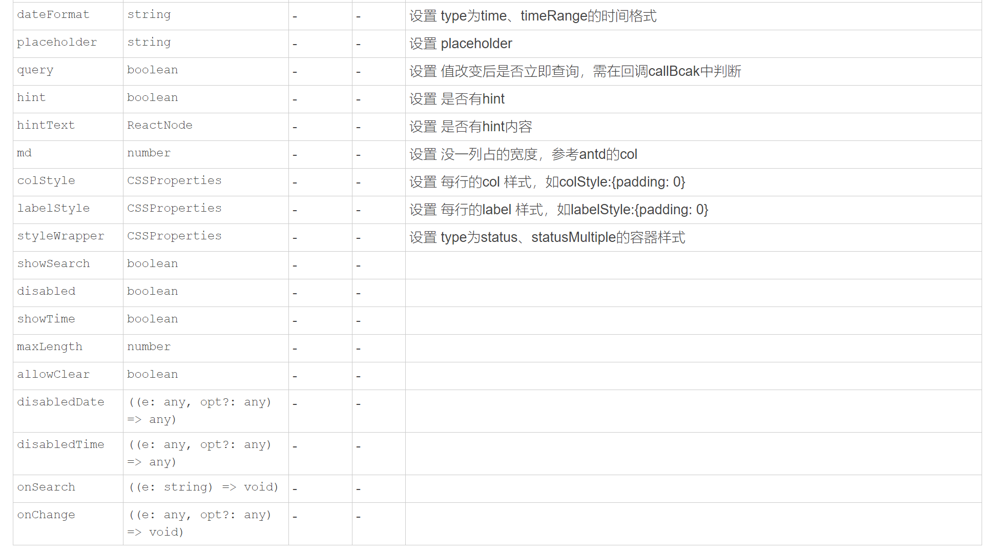

## antd components library
## 使用 React+typescript 的组件库

  

  

  

  

~~~javascript
npm install antdpackaging --save
~~~

### 使用
~~~javascript
// 加载样式
import 'antdpackaging/dist/index.css'
// 引入组件
import { FormComponent } from 'antdpackaging'
// 代码示例
function App() {
  const [currentObj, setObj] = useState({checkbox: "上海"});
  let QuickSearchProTypeDic = [
    {
      'key': '',
      'value': '所有'
    },
    {
      'key': 'Jack',
      'value': 'Jack'
    },
    {
      'key': 'Lucy',
      'value': 'Lucy'
    },
    {
      'key': 'Tom',
      'value': 'Tom'
    }
  ];
  let QuickSearch = [
    {
      key: 'beijing',
      label: 'beijing',
      disabled: true,
      value: '北京'
    },
    {
      key: 'shanghai',
      label: 'shanghai',
      value: '上海'
    }
  ];
  let sourceList = [
    [ // 多选
      {
        type: 'statusMultiple', md: 24, label: '多选', value: '', key: 'names', query: true,
        options: QuickSearchProTypeDic,
      },
    ],
    [ // 单选
      {
        type: 'status', md: 24, label: '单选', value: '', key: 'name', query: true,
        options: QuickSearchProTypeDic,
      },
    ],
    [
      { type: 'input', must: true, hint: true, hintText: '友情提示', label: 'Username', value: currentObj.Username, key: 'Username' },
      {
        type: 'select', label: 'AreaLabel',
        mode: 'multiple',
        options: QuickSearch,
        optionsObj: { key: 'label', value: 'label' },
        value: currentObj.AreaLabel, key: 'AreaLabel'
      },
      {
        type: 'select', label: 'Area',
        showSearch: true,
        options: QuickSearch,
        value: currentObj.Area, key: 'Area'
      }
    ],
    [
      {
        type: 'checkbox', label: 'checkbox',
        options: QuickSearch,
        optionsObj: { key: 'value', value: 'value' },
        value: currentObj.checkbox, key: 'checkbox'
      },
      {
        type: 'radio', label: 'radio',
        options: QuickSearch,
        optionsObj: { key: 'value', value: 'value' },
        value: currentObj.radio, key: 'radio'
      },
    ],
    [
      { type: 'time', label: 'time', value: currentObj.time, key: 'time' },
      {
        type: 'timeRange', label: 'timeRange', value: currentObj.timeRange, key: 'timeRange', showTime: true, dateFormat: 'YYYY-MM-DD HH:mm:ss'
      },
      {
        type: 'buttons',
        key: 

          <Button type="primary" onClick={() => {
            query()
          }
          }>
            查询
        </Button>
        

      }
    ]
  ]

  const query = () => (
    console.log(currentObj)
  )
  useEffect(() => {
  }, [currentObj]);
  const callBcak = (dt, item) => {
    setObj(dt)
    if (item && item.query) {
      query()
    }

  }
  return (
    

      <FormComponent callBcak={(dt, item) => {
        callBcak(dt, item)
      }
      } sourceList={sourceList} />
    

  );
}

export default App;

~~~

~~~bash
//启动本地环境
npm run stroybook

// build可发布静态文件
npm run build
// 本地连调 antdpackaging项目
npm link

// 本地项目
npm link antdpackaging
// 相对路劲
npm link ../antdpackaging/node_modules/react
~~~
