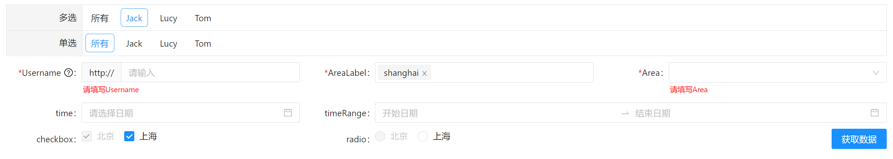

## antd components library

## 使用 React+typescript 的组件库

对于antd表单的二次封装，便于项目中方便使用，减少代码书写

~~~bash
//启动本地环境
npm run stroybook

~~~

  

~~~javascript
npm install antdpackaging --save
~~~

### 使用
~~~javascript
// 加载样式
import 'antdpackaging/dist/index.css'

// 引入组件
import { FormComponent } from 'antdpackaging'

// 代码示例
function App() {
  const [ currentObj, setObj ] = useState({
    name: '',
    names: ['Jack-value', 'Lucy-value'],
    Username: '',
    AreaLabel: ['shanghai'],
    Area: '',
    time: '',
    timeRange: [],
    checkbox: ['beijing', 'shanghai'],
    radio: '北京',
  });
  let QuickSearchTypeDic = [
    {
      'value': '',
      'label': '所有'
    },
    {
      'value': 'Jack-value',
      'label': 'Jack'
    },
    {
      'value': 'Lucy-value',
      'label': 'Lucy'
    },
    {
      'value': 'Tom-value',
      'label': 'Tom'
    }
  ];
  let QuickSearch = [
    {
      key: 'beijing',
      disabled: true,
      value: '北京',
      label: '北京'
    },
    {
      key: 'shanghai',
      value: '上海',
      label: '上海'
    }
  ];
  let sourceList = [
    [ // 多选
      {
        type: 'statusMultiple', md: 24, label: '多选', value: currentObj.names, key: 'names', query: true,
        options: QuickSearchTypeDic,
      },
    ],
    [ // 单选
      {
        type: 'status', md: 24, label: '单选', value: currentObj.name, key: 'name', query: true,
        options: QuickSearchTypeDic
      },
    ],
    [
      { type: 'input', must: true, hint: true, hintText: '友情提示', label: 'Username', value: currentObj.Username, key: 'Username' },
      {
        type: 'select', label: 'AreaLabel',
        mode: 'multiple',
        options: QuickSearch,
        optionsObj: { label: 'label', value: 'key' },
        value: currentObj.AreaLabel, key: 'AreaLabel'
      },
      {
        type: 'select', label: 'Area',
        showSearch: true,
        onSearch: (e: string) => {
          console.log(e)
        },
        options: QuickSearch,
        value: currentObj.Area, key: 'Area'
      }
    ],
    [
      { type: 'time', label: 'time', value: currentObj.time, key: 'time' },
      {
        type: 'timeRange', md: 16, label: 'timeRange', value: currentObj.timeRange, key: 'timeRange', showTime: true, dateFormat: 'YYYY-MM-DD HH:mm:ss'
      }
    ],
    [
      {
        type: 'checkbox', label: 'checkbox',
        options: QuickSearch,
        optionsObj: { label: 'value', value: 'key' },
        value: currentObj.checkbox, key: 'checkbox'
      },
      {
        type: 'radio', label: 'radio',
        options: QuickSearch,
        value: currentObj.radio, key: 'radio'
      },
      {
        type: 'buttons',
        key: 

          <Button type="primary" onClick={() => {
            query()
            action('callBcak')
          }
          }>
            获取数据
          </Button>
        

      }
    ]
  ]

  const query = (dt, item) => {
    if (dt) {
      // 点击后立即获取数据
      if (item&&item.query) {
        console.log('点击后立即获取数据',dt)
      }
    } else {
      // 点击获取数据按钮后获取数据
      console.log('点击查询按钮后获取数据',currentObj)
    }
  }
  // useEffect(() => {
  //   if (currentItem && currentItem.query) {
  //     query()
  //   }
  // }, [currentObj]);
  const callBcak = (dt, item) => {
    // setItem(item)
    setObj(dt)
    query(dt, item)
  }
  return (
    

      <FormComponent callBcak={(dt, item) => {
        callBcak(dt, item)
      }
      } sourceList={sourceList} />
    

  );
}

export default App;

~~~

  <h3 style="margin: 20px 0px 0px;">FormComponent Component</h3>
  <table class="info-table" style="width: 100%;">
    <thead>
      <tr>
        <th width="10%" style="max-width: 10%;min-width: 10%;">property</th>
        <th width="20%" style="max-width: 20%;min-width: 20%;">propType</th>
        <th width="5%" style="max-width: 5%;min-width: 5%;">required</th>
        <th width="5%" style="max-width: 5%;min-width: 5%;">default</th>
        <th width="60%" style="max-width: 60%;min-width: 60%;">description</th>
      </tr>
    </thead>
    <tbody>
      <tr>
        <td class="info-table-monospace">sourceList</td>
        <td class="info-table-monospace">object[]</td>
        <td>yes</td>
        <td>-</td>
        <td>设置 数据源</td>
      </tr>
      <tr>
        <td class="info-table-monospace">className</td>
        <td class="info-table-monospace">string</td>
        <td>-</td>
        <td>-</td>
        <td>设置 容器的className</td>
      </tr>
      <tr>
        <td class="info-table-monospace">style</td>
        <td class="info-table-monospace">CSSProperties</td>
        <td>-</td>
        <td>-</td>
        <td>设置 每行的style</td>
      </tr>
      <tr>
        <td class="info-table-monospace">callBcak</td>
        <td class="info-table-monospace">((backData: any, item?: FormComponentItemProps) =&gt; void) |
            undefined</td>
        <td>-</td>
        <td>-</td>
        <td>设置 回调函数,参数一为当前表单的数据,参数二为当前行的传入数据</td>
      </tr>
      <tr>
        <td class="info-table-monospace">size</td>
        <td class="info-table-monospace">"small" | "middle" | "large"</td>
        <td>-</td>
        <td>middle</td>
        <td>设置 每一行表单的大小</td>
      </tr>
    </tbody>
  </table>

  <h3 style="margin: 20px 0px 0px;">SourceListItem</h3>
  <table class="info-table" style="width: 100%;">
    <thead>
      <tr>
        <th width="10%" style="max-width: 10%;min-width: 10%;">property</th>
        <th width="20%" style="max-width: 20%;min-width: 20%;">propType</th>
        <th width="5%" style="max-width: 5%;min-width: 5%;">required</th>
        <th width="5%" style="max-width: 5%;min-width: 5%;">default</th>
        <th width="60%" style="max-width: 60%;min-width: 60%;">description</th>
      </tr>
    </thead>
    <tbody>
      <tr>
        <td class="info-table-monospace">type</td>
        <td class="info-table-monospace">string</td>
        <td>-</td>
        <td>-</td>
        <td>设置 表单类型 status、statusMultiple、input、time、timeRange、text、select、buttons、checkbox、radio</td>
      </tr>
      <tr>
        <td class="info-table-monospace">label</td>
        <td class="info-table-monospace">string</td>
        <td>-</td>
        <td>-</td>
        <td>设置 label名称</td>
      </tr>
      <tr>
        <td class="info-table-monospace">key</td>
        <td class="info-table-monospace">any</td>
        <td>-</td>
        <td>-</td>
        <td>设置 返回主键值， type为text、buttons时返回传入值</td>
      </tr>
      <tr>
        <td class="info-table-monospace">must</td>
        <td class="info-table-monospace">boolean</td>
        <td>-</td>
        <td>-</td>
        <td>设置 是否必填</td>
      </tr>
      <tr>
        <td class="info-table-monospace">value</td>
        <td class="info-table-monospace">string</td>
        <td>-</td>
        <td>-</td>
        <td>设置 默认回显值格式statusMultiple: ['value1', 'value2'];timeRange: ['2021-02-12','2021-02-13']</td>
      </tr>
      <tr>
        <td class="info-table-monospace">colClassName</td>
        <td class="info-table-monospace">string</td>
        <td>-</td>
        <td>-</td>
        <td>设置 每行的col className</td>
      </tr>
      <tr>
        <td class="info-table-monospace">formClassName</td>
        <td class="info-table-monospace">string</td>
        <td>-</td>
        <td>-</td>
        <td>设置 form的className</td>
      </tr>
      <tr>
        <td class="info-table-monospace">labelClassName</td>
        <td class="info-table-monospace">string</td>
        <td>-</td>
        <td>-</td>
        <td>设置 labelClassName的className</td>
      </tr>
      <tr>
        <td class="info-table-monospace">options</td>
        <td class="info-table-monospace">object[]</td>
        <td>-</td>
        <td>-</td>
        <td> 设置 type为select、checkbox、radio、status、statusMultiple时的选项，  格式[{label: '中国', value:
            '中国'}],选择返回label值  checkbox、radio格式[{label: '中国', value: '中国', disabled: true}] 
            禁止某项</td>
      </tr>
      <tr>
        <td class="info-table-monospace">mode</td>
        <td class="info-table-monospace">"multiple" | "tags"</td>
        <td>-</td>
        <td>-</td>
        <td>设置 Select 的模式为多选或标签 multiple | tags</td>
      </tr>
      <tr>
        <td class="info-table-monospace">optionsObj</td>
        <td class="info-table-monospace">{ label: string; value: string; }</td>
        <td>-</td>
        <td>-</td>
        <td> 设置 type为select、checkbox、radio、status、statusMultiple时的选项显示和返回字段，如果options的格式不是[{label: '中国', value:
            '中国'}]，  可以通过optionsObj实现，如[{label: '中国', value:
            '中国'}],设置optionsObj:{label:'label',value:'key'}  选择返回key值</td>
      </tr>
      <tr>
        <td class="info-table-monospace">dateFormat</td>
        <td class="info-table-monospace">string</td>
        <td>-</td>
        <td>-</td>
        <td>设置 type为time、timeRange的时间格式</td>
      </tr>
      <tr>
        <td class="info-table-monospace">placeholder</td>
        <td class="info-table-monospace">string</td>
        <td>-</td>
        <td>-</td>
        <td>设置 placeholder</td>
      </tr>
      <tr>
        <td class="info-table-monospace">query</td>
        <td class="info-table-monospace">boolean</td>
        <td>-</td>
        <td>-</td>
        <td>设置 值改变后是否立即查询，需在回调callBcak中判断</td>
      </tr>
      <tr>
        <td class="info-table-monospace">hint</td>
        <td class="info-table-monospace">boolean</td>
        <td>-</td>
        <td>-</td>
        <td>设置 是否有hint</td>
      </tr>
      <tr>
        <td class="info-table-monospace">hintText</td>
        <td class="info-table-monospace">ReactNode</td>
        <td>-</td>
        <td>-</td>
        <td>设置 是否有hint内容</td>
      </tr>
      <tr>
        <td class="info-table-monospace">md</td>
        <td class="info-table-monospace">number</td>
        <td>-</td>
        <td>-</td>
        <td>设置 没一列占的宽度，参考antd的col</td>
      </tr>
      <tr>
        <td class="info-table-monospace">colStyle</td>
        <td class="info-table-monospace">CSSProperties</td>
        <td>-</td>
        <td>-</td>
        <td>设置 每行的col 样式，如colStyle:{padding: 0}</td>
      </tr>
      <tr>
        <td class="info-table-monospace">labelStyle</td>
        <td class="info-table-monospace">CSSProperties</td>
        <td>-</td>
        <td>-</td>
        <td>设置 每行的label 样式，如labelStyle:{padding: 0}</td>
      </tr>
      <tr>
        <td class="info-table-monospace">styleWrapper</td>
        <td class="info-table-monospace">CSSProperties</td>
        <td>-</td>
        <td>-</td>
        <td>设置 type为status、statusMultiple的容器样式</td>
      </tr>
      <tr>
        <td class="info-table-monospace">showSearch</td>
        <td class="info-table-monospace">boolean</td>
        <td>-</td>
        <td>-</td>
        <td></td>
      </tr>
      <tr>
        <td class="info-table-monospace">disabled</td>
        <td class="info-table-monospace">boolean</td>
        <td>-</td>
        <td>-</td>
        <td></td>
      </tr>
      <tr>
        <td class="info-table-monospace">showTime</td>
        <td class="info-table-monospace">boolean</td>
        <td>-</td>
        <td>-</td>
        <td></td>
      </tr>
      <tr>
        <td class="info-table-monospace">maxLength</td>
        <td class="info-table-monospace">number</td>
        <td>-</td>
        <td>-</td>
        <td></td>
      </tr>
      <tr>
        <td class="info-table-monospace">allowClear</td>
        <td class="info-table-monospace">boolean</td>
        <td>-</td>
        <td>-</td>
        <td></td>
      </tr>
      <tr>
        <td class="info-table-monospace">disabledDate</td>
        <td class="info-table-monospace">((e: any, opt?: any) =&gt; any)</td>
        <td>-</td>
        <td>-</td>
        <td></td>
      </tr>
      <tr>
        <td class="info-table-monospace">disabledTime</td>
        <td class="info-table-monospace">((e: any, opt?: any) =&gt; any)</td>
        <td>-</td>
        <td>-</td>
        <td></td>
      </tr>
      <tr>
        <td class="info-table-monospace">onSearch</td>
        <td class="info-table-monospace">((e: string) =&gt; void)</td>
        <td>-</td>
        <td>-</td>
        <td></td>
      </tr>
      <tr>
        <td class="info-table-monospace">onChange</td>
        <td class="info-table-monospace">((e: any, opt?: any) =&gt; void)</td>
        <td>-</td>
        <td>-</td>
        <td></td>
      </tr>
    </tbody>
  </table>
  

